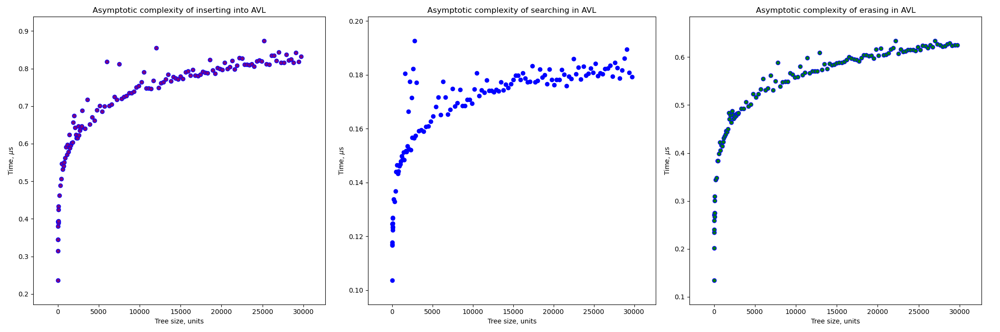
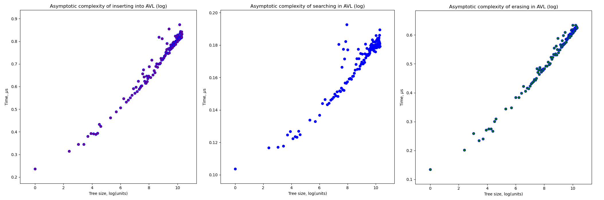

# trees_lab

Here are the results for testing trees with the profiler. First, it fills the tree with random elements up to a certain size of a tree. Then the three functions (insert(), erase() and find()) are tested separately.
 
Let's start with checking how the profiler works on std::set. Here are the plots with the true units. Each point is averaged on 1000 equal numbers and 2000 different ones.

Prof that the relation is logarithmic in different scales

Let's go ahead and test Sasha's red-black tree. Each point is averaged on 2000 equal numbers and 4000 different ones (it took for std::set longer to do the same operations, which would take way more time to make more iterations there)

And tree sizes to logarithmical.

Same with Arkadiy's AVL-tree.

